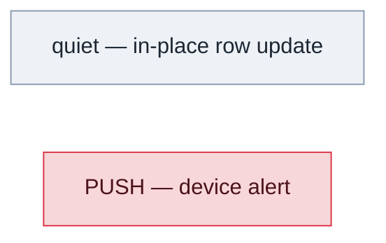
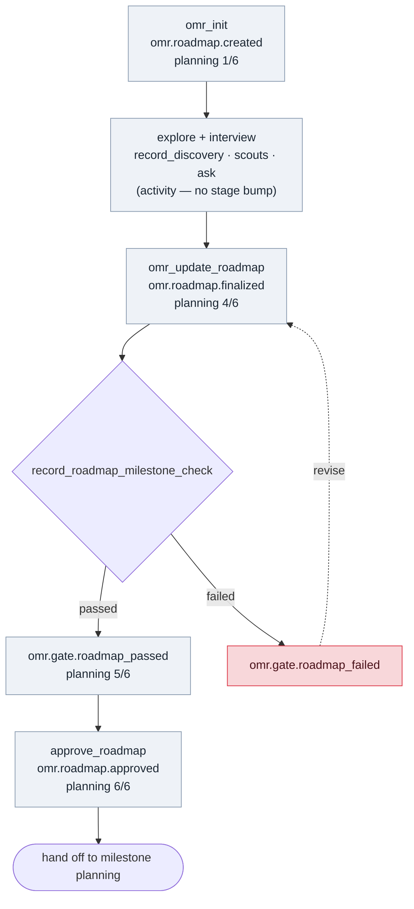
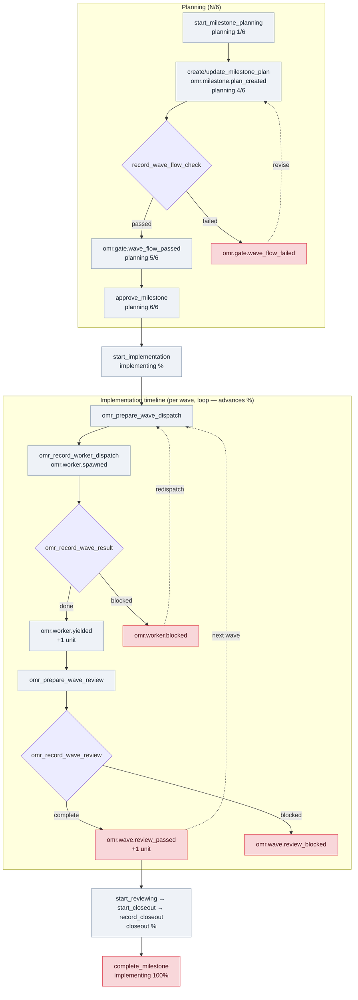
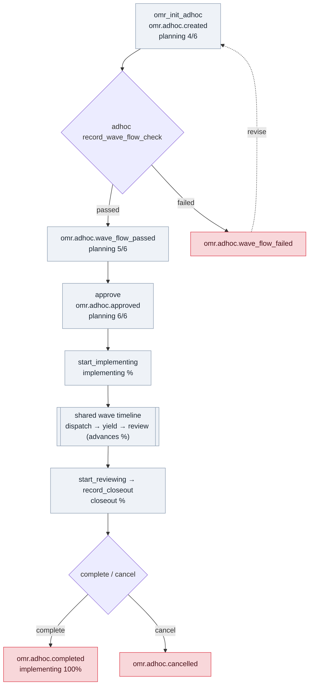

# Moshi live-activity flows

These diagrams show how each OMR workflow drives its Moshi **live activity** — the single per-session inbox row that updates in place as the flow progresses. Every frame in a flow shares one `sessionId`, so the row is one continuously-updating activity, not separate notifications. The row **title** carries live progress: `planning N/6` during planning and `implementing NN%` during implementation.

**Legend**

- **Quiet** frames (`session_started` / `tool_running` / `tool_finished`) update the row in place — no device alert.
- **PUSH** frames (`approval_required` / `task_complete`) are high-priority device alerts; `approval_required` also flips the row `phase` to `waitingForApproval`.
- Planning stages are the canonical six — `start → explore → interview → plan → checker → approval` — but the counter only advances at the hard tool **checkpoints** (start = 1/6, plan = 4/6, checker = 5/6, approval = 6/6). `explore`/`interview` are agent activity (scout/context/discovery calls and the `ask` tool) counted in the denominator but not surfaced as their own frames.
- Implementation `%` denominator = `1 (start) + all worker tasks + all wave reviews + 1 (closeout)`; it advances as each worker yields and each wave review passes.

## New roadmap (planning-only)

A roadmap ends at approval and hands off to per-milestone flows; it has no implementation phase of its own.

## Milestone plan + implement

Also on this flow: `request_bypass` → `omr.bypass.requested` (PUSH); `clear_bypass` (quiet). Change requests reuse the same implementation timeline (`approve_change`/`update_change_request_plan` quiet, `close_change` PUSH).

## Ad-hoc plan + implement

`omr_init_adhoc` records the whole plan in one call, so the flow surfaces from `plan` (4/6) onward; explore/interview still occur via `ask`/scout beforehand.

## Cross-cutting

While any OMR flow is active, two host events also fire (both PUSH): the `ask` tool → `omr.ask.input_required` (needs input — this is the "interview" signal during planning), and `agent_end` → an `omr.agent.stopped*` / `omr.adhoc.stopped*` summary of what the flow needs next. Their titles also carry the current `planning N/6` or `implementing NN%` progress.

## Debugging

Set `moshi.trace: true` in `.omr/config.yml` (or `OMR_MOSHI_TRACE=1`) to append a per-project decision trace to `.omr/logs/moshi.ndjson` — one JSON record per line for each considered / mapped / suppressed / sending / sent / failed step. Hand that file over when a notification does not behave as expected.
